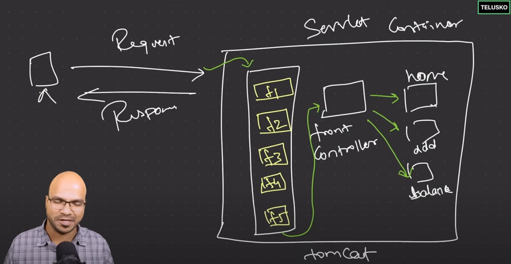

# 🔰 Security Filters

In Spring Security, **filters** are used to intercept and process HTTP requests and responses before they reach the main application logic, typically handled by the `DispatcherServlet`. When you add security to your Spring application, you use a series of **security filters** that ensure the request is authenticated and authorized before being routed to the correct controller or endpoint.

Here’s a breakdown of some key Spring Security filters:

1. **`SecurityContextPersistenceFilter`**:
   * This filter manages the `SecurityContext`, which holds the security information of the user (like authentication status).
   * It ensures that the `SecurityContext` is stored and retrieved across different requests (usually from the session).
2. **`UsernamePasswordAuthenticationFilter`**:
   * Responsible for handling form-based login (i.e., username and password authentication).
   * It processes login requests (POSTs to `/login`) and tries to authenticate the user with the provided credentials.
3. **`BasicAuthenticationFilter`**:
   * Used when HTTP Basic authentication is configured.
   * It extracts credentials from the request's `Authorization` header and attempts authentication.
4. **`BearerTokenAuthenticationFilter`**:
   * Used for JWT or OAuth2 Bearer tokens.
   * It extracts the token from the request, validates it, and creates an authentication object.
5. **`CsrfFilter`**:
   * This filter provides protection against Cross-Site Request Forgery (CSRF) attacks by ensuring a valid CSRF token is present in requests that modify data.
6. **`ExceptionTranslationFilter`**:
   * Handles any `AccessDeniedException` or `AuthenticationException` that occurs during filter processing.
   * Redirects unauthenticated users to the login page or returns an HTTP 403 error if access is denied.
7. **`FilterSecurityInterceptor`**:
   * This is the final filter in the chain that ensures the request has the necessary permissions to access the resource (authorization).
   * It works with the security configuration (like roles, authorities, etc.) to decide if a request should be allowed or denied.
8. **`LogoutFilter`**:
   * Manages the logout process by invalidating the session and clearing the `SecurityContext`.

<figure><figcaption></figcaption></figure>

